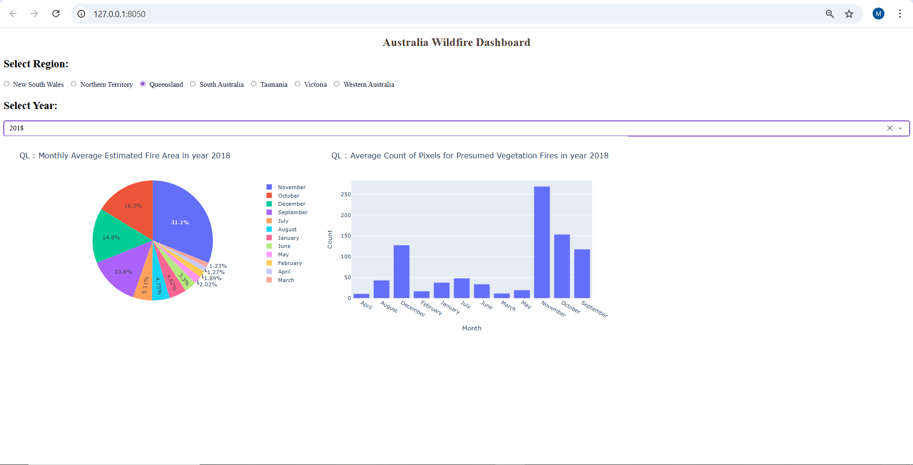

# 🇦🇺 Australia Wildfire Interactive Dashboard

An advanced, interactive data visualization web application built with **Python**, **Dash**, and **Plotly**. This project analyzes historical wildfire data in Australia, providing real-time insights into fire patterns, affected areas, and vegetation impact.

##  Key Features
- **Dynamic Data Filtering:** Users can filter over **26,000+ records** of wildfire data by Region and Year.
- **Interactive Visualizations:**
  - **Pie Chart:** Displays the Monthly Average Estimated Fire Area, allowing users to see the proportional impact per month.
  - **Bar Chart:** Visualizes the Monthly Average Count of Pixels for Presumed Vegetation Fires.
- **Reactive Backend:** Built using Dash Callbacks to ensure seamless, real-time updates of all visual components without reloading the page.
- **Clean Architecture:** Separation of concerns with dedicated files for dependencies, environment settings, and data.

##  Tech Stack & Tools
- **Core Language:** Python 3.10+
- **Data Manipulation:** [Pandas](https://pandas.pydata.org/) (Data Cleaning, Grouping, and Aggregation)
- **Dashboard Framework:** [Dash by Plotly](https://dash.plotly.com/) (Web interface and Callbacks)
- **Data Visualization:** [Plotly Express](https://plotly.com/python/plotly-express/)
- **Environment Management:** Virtualenv (Venv)

##  Project Structure
```text
Australia-Wildfire-Dashboard/
├── app.py                   # Main application logic and layout
├── Historical_Wildfires.csv  # Cleaned dataset (26k+ fire events)
├── requirements.txt         # List of Python dependencies
├── .gitignore               # Ensures virtual environments are not tracked
└── README.md                # Project documentation and guide

 Installation & Getting Started
1. Clone the repository
    git clone [https://github.com/MohamedAshraf2710/Australia-Wildfire-Dashboard.git](https://github.com/your-username/Australia-Wildfire-Dashboard.git)
    cd Australia-Wildfire-Dashboard

2. Set up a Virtual Environment
    python -m venv myenv
 On Windows:
    myenv\Scripts\activate

3. Install Dependencies
    pip install -r requirements.txt

4. Run the Application
    python app.py

Open your browser and visit http://127.0.0.1:8050/ to explore the dashboard.



Developed by Mohamed Ashraf
AI Engineer| Backend Developer
    https://www.linkedin.com/in/mohamed-ashraf-shaaban/